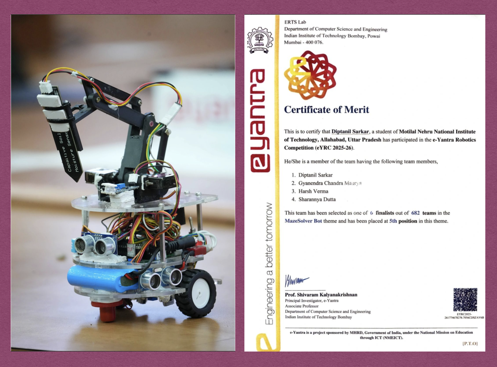

# 🤖 FPGA-Based Maze Solver Bot for Agricultural Storerooms

**e-Yantra Robotics Competition (eYRC 2025-26) · IIT Bombay · MazeSolver Bot Theme**

🏆 **5th Position** among **682 teams** across India · Top 100 (Stage 2) → Top 6 Finalists

---
<p align="center">
  
</p>

## 📖 Overview

An autonomous, FPGA-controlled maze solver bot designed for **agricultural storeroom environments**. The bot navigates a maze on its own, explores all dead ends, detects soil containers, and measures **soil moisture, temperature, and humidity**. The readings are transmitted in real time over **Bluetooth** to a laptop or mobile device, so the condition of stored harvest can be monitored remotely.

## ✨ Features

- Autonomous maze navigation with full dead-end exploration
- Obstacle and wall sensing using ultrasonic distance sensors
- Soil container detection
- Soil moisture measurement with a capacitive soil moisture sensor mounted on a robotic arm
- Temperature and humidity monitoring
- Real-time wireless data transmission over Bluetooth (UART)
- FPGA-based design with a RISC-V CPU architecture

## 🛠️ Hardware

| Component | Purpose |
|---|---|
| FPGA board (Intel) | Main controller (kit provided by IIT Bombay) |
| Ultrasonic sensors | Distance measurement and wall detection |
| Capacitive soil moisture sensor | Soil moisture measurement |
| Temperature & humidity sensor | Micro-climate monitoring |
| Robotic arm | Positions the soil moisture sensor |
| Bluetooth module | Wireless data transmission |
| Li-ion battery pack | Power supply |
| Acrylic chassis, wheels, custom PCB | Structure, mobility, and wiring |

## 💻 Software & Tools

- **Verilog** for digital design
- **Intel Quartus** FPGA tools, USB Blaster, and SignalTap for debugging
- **RISC-V** toolchain and compiler setup
- **MB GUI / MB Grader App** for evaluation
- Maze-solving algorithm implemented for full exploration

## 🗓️ Competition Timeline

**Stage 1 – Learning & Design (all 682 teams)**

| Period | Activity |
|---|---|
| Sept–Oct 2025 | Learn & Explore (concept learning and setup) |
| Oct–Nov 2025 | Advanced learning and problem analysis |
| Nov–Dec 2025 | Algorithm development and design preparation |

➡️ Top 100 teams selected for Stage 2

**Stage 2 – Hardware Implementation (Top 100 teams)**

| Period | Activity |
|---|---|
| Dec 2025 – Jan 2026 | Hardware testing and sensor interfacing |
| Jan 2026 | Mini theme run and progress evaluation |
| Feb 2026 | Demo video and code submission |
| 27–29 March 2026 | Finals at IIT Bombay (Top 6 teams) |

## 📚 Concepts Covered

- Digital Electronics
- Verilog and Digital Circuits
- Frequency Scaling and PWM
- Ultrasonic Distance Measurement
- Temperature and Humidity Measurement
- CPU Design and RISC-V CPU Architecture
- UART Protocol (Transmitter & Receiver)
- Maze Solver Algorithm Development
- RISC-V Compiler Setup
- Clock Domain Crossing
- Intel FPGA Tools, USB Blaster, SignalTap Debugging
- Bluetooth Module Integration
- PCB Preparation and Arena Design
- Soil Moisture and Micro-Climate Measurement

## 📁 Repository Structure

<!-- Update this section to match your repository -->
```
├── verilog/        # FPGA design files
├── software/       # RISC-V / embedded code
├── docs/           # Design documents, demo video, images
└── README.md
```

## 🚀 Getting Started

<!-- Fill in the steps that match your setup -->
1. Clone this repository.
2. Open the Quartus project and compile the design.
3. Program the FPGA using USB Blaster.
4. Pair the Bluetooth module with your laptop or phone.
5. Place the bot in the arena and start the run.

## 👥 Team

| Name | Institution |
|---|---|
| Diptanil Sarkar | MNNIT Allahabad |
| Sharannya Dutta | MNNIT Allahabad |
| Harsh Verma | MNNIT Allahabad |
| Gyanendra Chandra Maurya | MNNIT Allahabad |

## 🙏 Acknowledgements

- **e-Yantra, IIT Bombay** (ERTS Lab, Department of Computer Science and Engineering) for organizing the competition and providing the hardware kit. e-Yantra is sponsored by MHRD, Government of India, under the National Mission on Education through ICT (NMEICT).
- Prof. Shivaram Kalyanakrishnan, Principal Investigator, e-Yantra.

## 📄 License

<!-- Add your license here, e.g. MIT -->

---

⭐ If you found this project interesting, feel free to star the repo!
